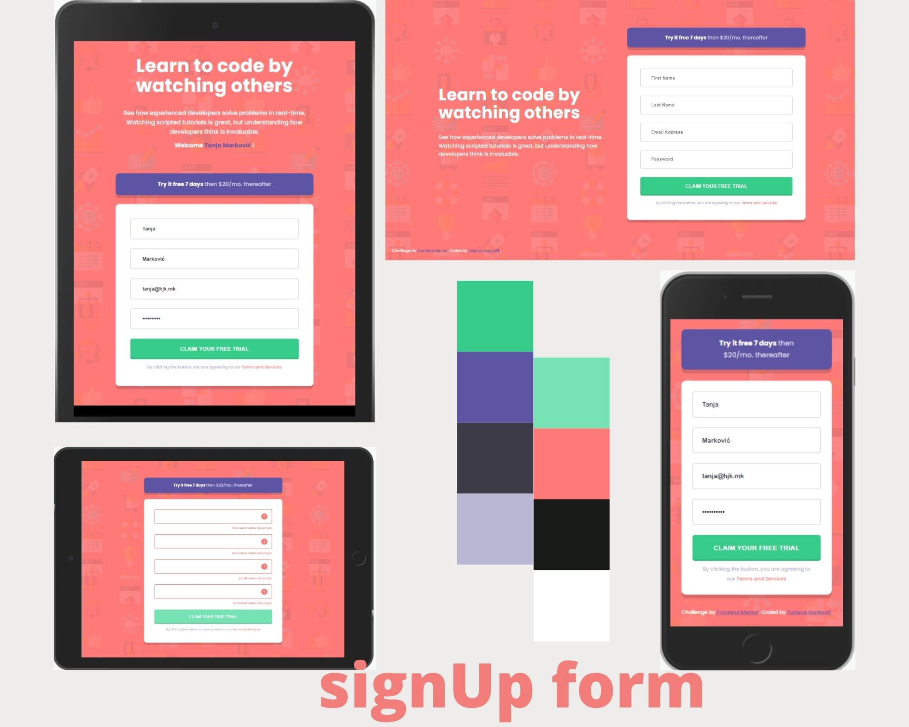
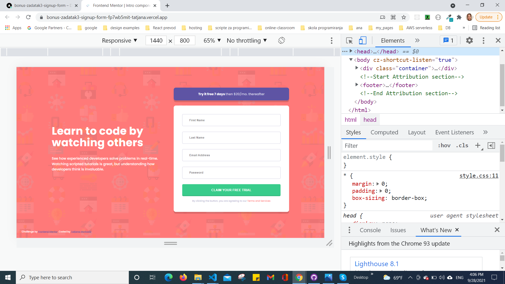
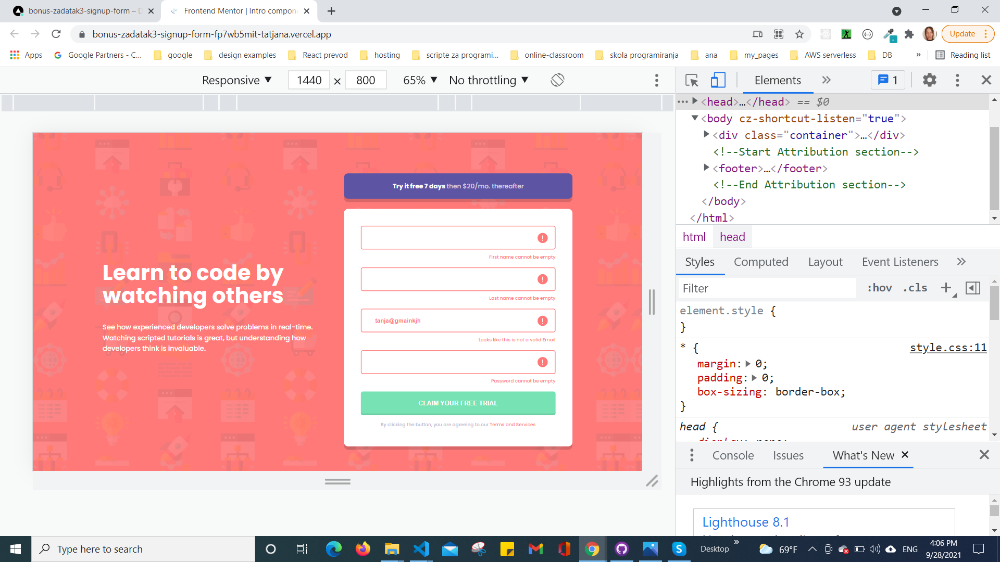
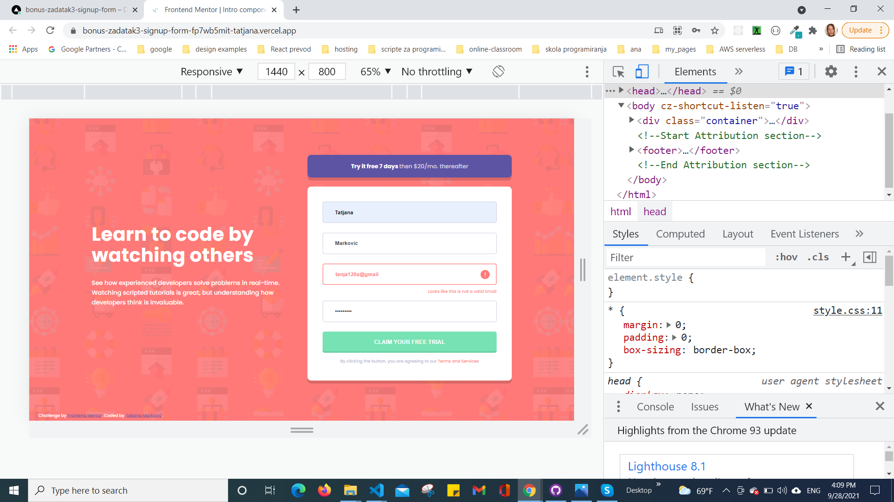
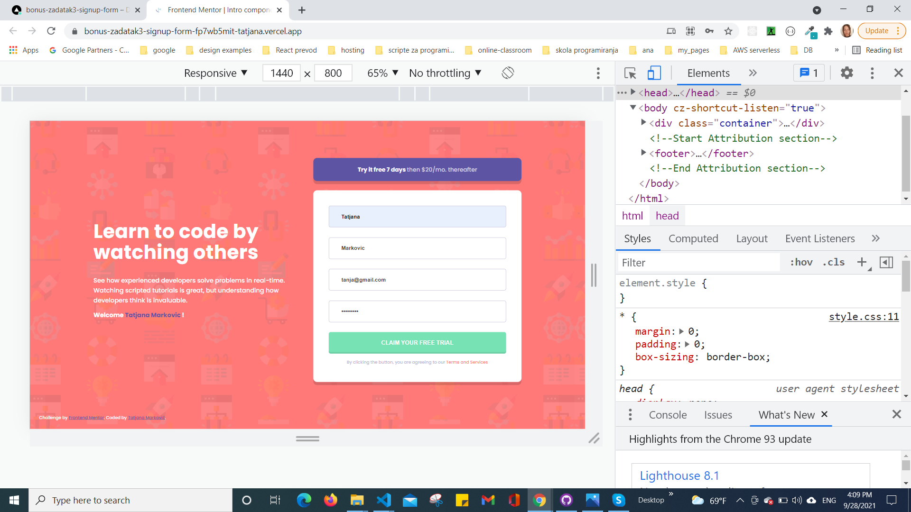
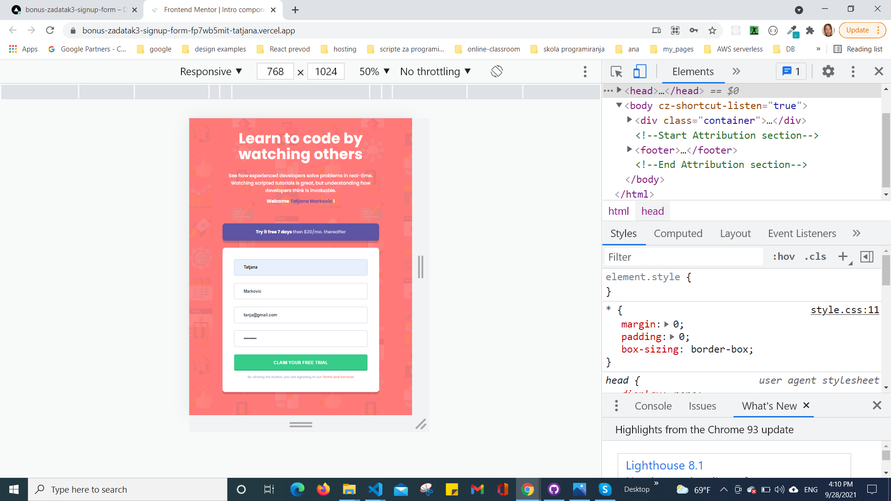
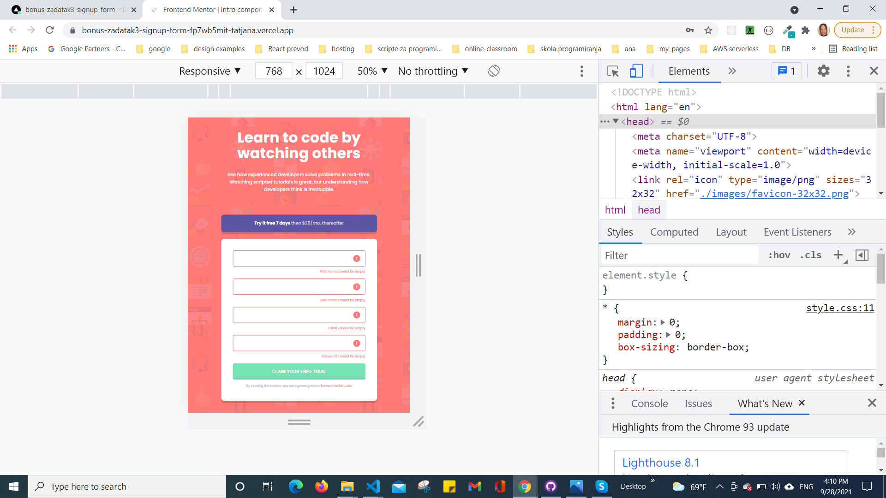
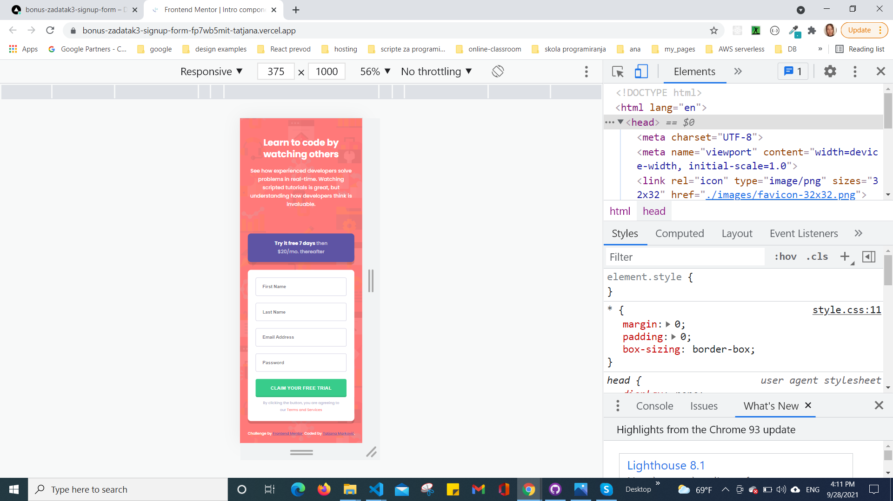
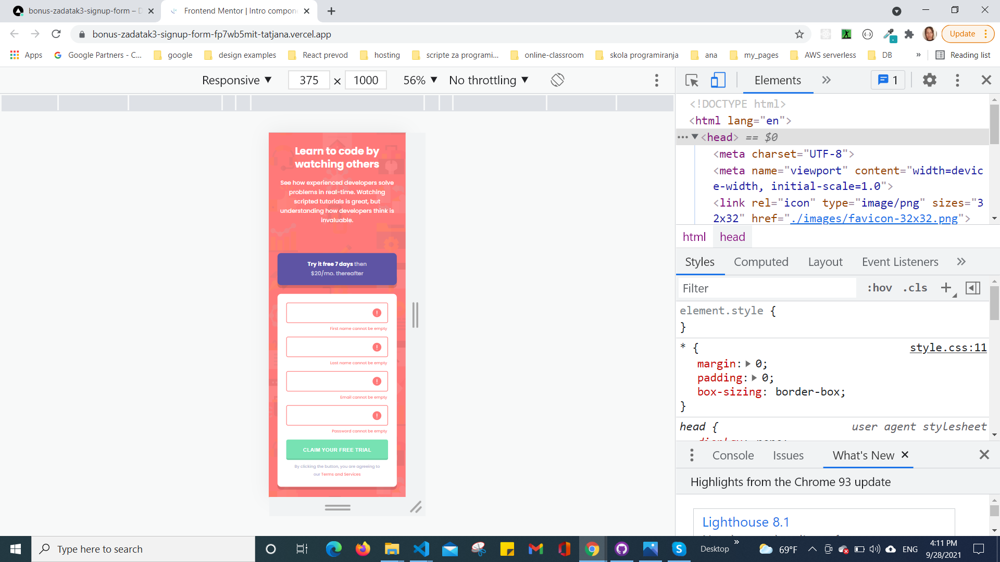

# Frontend Mentor - Intro component with sign up form solution

This is a solution to the [Intro component with sign up form challenge on Frontend Mentor](https://www.frontendmentor.io/challenges/intro-component-with-signup-form-5cf91bd49edda32581d28fd1). Frontend Mentor challenges help you improve your coding skills by building realistic projects. 

## Table of contents

  - [Overview](#overview)
  - [The challenge](#the-challenge)
  - [Screenshot](#screenshot)
  - [Links](#links)
  - [My process](#my-process)
  - [Built with](#built-with)
  - [Author](#author)

## Overview
Validation:
Name - Letters.
Email - something@site.extension
Password - A lowercase letter, a capital letter, a number, minimum 8 characters.

### The challenge

Users should be able to:

- View the optimal layout for the site depending on their device's screen size
- See hover states for all interactive elements on the page
- Receive an error message when the `form` is submitted if:
  - Any `input` field is empty. The message for this error should say *"[Field Name] cannot be empty"*
  - The email address is not formatted correctly (i.e. a correct email address should have this structure: `name@host.tld`). The message for this error should say *"Looks like this is not an email"*

### Screenshot

### Links

- Solution URL: [GitHub](https://github.com/tatjama/bonus-zadatak3-signup-form/tree/develop)
- Preview : [Vercel](https://bonus-zadatak3-signup-form-fp7wb5mit-tatjana.vercel.app/)
- Live Site URL: [Vercel](https://bonus-zadatak3-signup-form.vercel.app/)

## My process

1. Create a new project
2. Import starting code
3. Initializing git repositories main and develop
4. Import git repositories to the Vercel project
5. Create HTML structure
6. Use Figma design tools for style
7. Create CSS Utility
8. Style for Desktop
9. Responsive breakpoints at 1200px
10. Responsive breakpoints at 375px
11. Create page behavior with JavaScript
12. Compare original designs with my work
13. Create screenshots
14. Change README-template.md to README.md
15. Open Pull request
16. Solve Issue
17. Merge develop branch into master branch
### Built with

- Semantic HTML5 markup
- Vanilla JavaScript
- CSS custom properties
- FlexBox
- Media queries
- Centering elements, content and text
- Background Image
- Element positioning
- Customize font,width and size
- Transparency
- Hover
## Author

- Website - [Tatjana Markovic](https://my-react-portfolio-tatjana.vercel.app/)
- LinkedIn - [Tatjana Marković](https://www.linkedin.com/in/tatjana-markovi%C4%87-919501189/)
- GitHub - [tatjama](https://github.com/tatjama)
